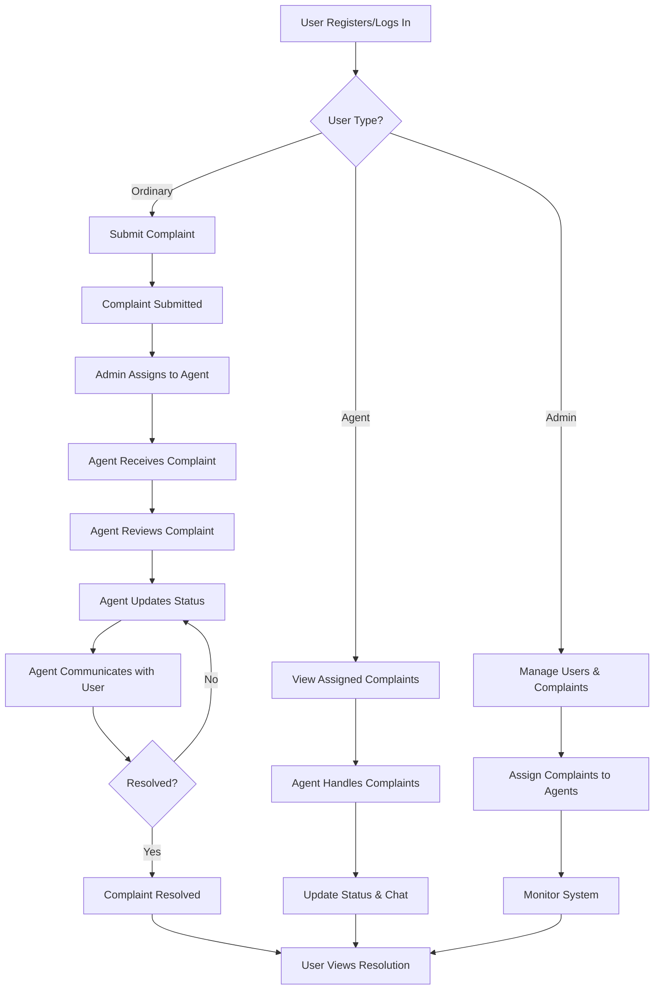

# ONLINE COMPLAINT REGISTRATION AND MANAGEMENT SYSTEM

A comprehensive web application for managing complaints submitted by users. The system supports three types of users: Ordinary users who can submit and track complaints, Agents who handle and resolve complaints, and Admins who manage users and oversee the system.

## Features

- **User Authentication**: Secure login and registration for all user types
- **Role-Based Access Control**: Different dashboards and permissions for Ordinary users, Agents, and Admins
- **Complaint Submission**: Users can submit detailed complaints with location information
- **Complaint Management**: Agents can view assigned complaints, update status, and communicate with users
- **Admin Dashboard**: Admins can manage users, assign complaints to agents, and view system statistics
- **Real-time Messaging**: Chat functionality between users and agents for complaint resolution
- **Status Tracking**: Users can monitor the progress of their complaints

## Tech Stack

### Backend
- **Node.js** with **Express.js** for server-side logic
- **MongoDB** with **Mongoose** for data storage
- **bcrypt** for password hashing
- **express-session** for session management
- **CORS** for cross-origin requests

### Frontend
- **React** for building the user interface
- **React Router** for client-side routing
- **Axios** for API communication
- **Bootstrap** and **MDB React UI Kit** for styling
- **React Icons** for iconography

## Installation

### Prerequisites
- Node.js (v14 or higher)
- MongoDB
- npm or yarn

### Backend Setup
1. Navigate to the backend directory:
   ```bash
   cd backend
   ```

2. Install dependencies:
   ```bash
   npm install
   ```

3. Configure MongoDB connection in `config/db.js`

4. Start the server:
   ```bash
   npm start
   ```
   The server will run on `http://localhost:8000`

### Frontend Setup
1. Navigate to the frontend directory:
   ```bash
   cd frontend
   ```

2. Install dependencies:
   ```bash
   npm install
   ```

3. Start the development server:
   ```bash
   npm start
   ```
   The app will be available at `http://localhost:3000`

## Usage

1. **Registration/Login**: Users can register as Ordinary users, Agents, or Admins
2. **Submit Complaint**: Ordinary users can submit complaints with detailed information
3. **Admin Assignment**: Admins assign complaints to available agents
4. **Agent Handling**: Agents view assigned complaints, update status, and communicate with users
5. **User Tracking**: Users can view complaint status and chat with assigned agents

## Project Structure

```
complaint-registry/
├── README.md
├── backend/
│   ├── index.js
│   ├── package.json
│   ├── config/
│   │   └── db.js
│   ├── controllers/
│   │   ├── adminController.js
│   │   ├── agentController.js
│   │   ├── authController.js
│   │   ├── messageController.js
│   │   └── userController.js
│   ├── models/
│   │   ├── AssignedComplaint.js
│   │   ├── Complaint.js
│   │   ├── Message.js
│   │   └── User.js
│   └── routes/
│       ├── adminRoutes.js
│       ├── agentRoutes.js
│       ├── authRoutes.js
│       ├── messageRoutes.js
│       └── userRoutes.js
└── frontend/
    ├── package.json
    ├── README.md
    ├── public/
    │   └── index.html
    └── src/
        ├── App.css
        ├── App.js
        ├── index.js
        ├── components/
        │   ├── admin/
        │   │   ├── AdminDashboard.jsx
        │   │   ├── AdminLayout.jsx
        │   │   ├── AgentInfo.jsx
        │   │   ├── UserInfo.jsx
        │   │   ├── api/
        │   │   │   ├── dashboardApi.js
        │   │   │   └── userApi.js
        │   │   ├── common/
        │   │   │   ├── DataGrid.jsx
        │   │   │   ├── DeleteConfirmationModal.jsx
        │   │   │   ├── EditUserModal.jsx
        │   │   │   ├── ManagementHeader.jsx
        │   │   │   ├── SearchUtility.jsx
        │   │   │   └── StatCard.jsx
        │   │   └── hooks/
        │   │       ├── useDashboard.js
        │   │       └── useUserManagement.js
        │   ├── agent/
        │   │   ├── AgentHome.jsx
        │   │   ├── AgentNavbar.jsx
        │   │   ├── ComplaintCard.jsx
        │   │   ├── api/
        │   │   │   ├── agentApi.js
        │   │   │   └── complaintApi.js
        │   │   ├── css/
        │   │   │   ├── AgentNavbar.module.css
        │   │   │   └── ComplaintCard.module.css
        │   │   └── hooks/
        │   │       ├── useAgentDashboard.js
        │   │       └── useComplaintActions.js
        │   ├── common/
        │   │   ├── common/
        │   │   │   ├── AuthCard.jsx
        │   │   │   ├── ChatWindow.jsx
        │   │   │   ├── FormInput.jsx
        │   │   │   ├── HeroSection.jsx
        │   │   │   ├── PasswordInput.jsx
        │   │   │   ├── PrimaryButton.jsx
        │   │   │   └── UserTypeDropdown.jsx
        │   │   ├── layout/
        │   │   │   ├── AppFooter.jsx
        │   │   │   ├── AppNavbar.css
        │   │   │   ├── AppNavbar.jsx
        │   │   │   ├── AuthFooter.jsx
        │   │   │   └── PageContainer.jsx
        │   │   ├── pages/
        │   │   │   ├── Home.jsx
        │   │   │   ├── Login.jsx
        │   │   │   └── SignUp.jsx
        │   │   └── routes/
        │   │       └── ProtectedRoute.jsx
        │   └── user/
        │       ├── Complaint.jsx
        │       ├── HomePage.jsx
        │       ├── Status.jsx
        │       ├── api/
        │       │   ├── statusApi.js
        │       │   └── userApi.js
        │       ├── css/
        │       │   ├── Complaint.module.css
        │       │   ├── HomePage.module.css
        │       │   └── Status.module.css
        │       └── hooks/
        │           ├── useComplaintForm.js
        │           └── useUserStatus.js
        └── Images/
```

### Folder Structure Diagram

```mermaid
graph TD
    A[complaint-registry] --> B[README.md]
    A --> C[backend/]
    A --> D[frontend/]
    
    C --> C1[index.js]
    C --> C2[package.json]
    C --> C3[config/]
    C --> C4[controllers/]
    C --> C5[models/]
    C --> C6[routes/]
    
    C3 --> C31[db.js]
    C4 --> C41[adminController.js]
    C4 --> C42[agentController.js]
    C4 --> C43[authController.js]
    C4 --> C44[messageController.js]
    C4 --> C45[userController.js]
    
    C5 --> C51[AssignedComplaint.js]
    C5 --> C52[Complaint.js]
    C5 --> C53[Message.js]
    C5 --> C54[User.js]
    
    C6 --> C61[adminRoutes.js]
    C6 --> C62[agentRoutes.js]
    C6 --> C63[authRoutes.js]
    C6 --> C64[messageRoutes.js]
    C6 --> C65[userRoutes.js]
    
    D --> D1[package.json]
    D --> D2[README.md]
    D --> D3[public/]
    D --> D4[src/]
    
    D3 --> D31[index.html]
    
    D4 --> D41[App.css]
    D4 --> D42[App.js]
    D4 --> D43[index.js]
    D4 --> D44[components/]
    D4 --> D45[Images/]
    
    D44 --> D441[admin/]
    D44 --> D442[agent/]
    D44 --> D443[common/]
    D44 --> D444[user/]
    
    D441 --> D4411[AdminDashboard.jsx]
    D441 --> D4412[AdminLayout.jsx]
    D441 --> D4413[AgentInfo.jsx]
    D441 --> D4414[UserInfo.jsx]
    D441 --> D4415[api/]
    D441 --> D4416[common/]
    D441 --> D4417[hooks/]
    
    D442 --> D4421[AgentHome.jsx]
    D442 --> D4422[AgentNavbar.jsx]
    D442 --> D4423[ComplaintCard.jsx]
    D442 --> D4424[api/]
    D442 --> D4425[css/]
    D442 --> D4426[hooks/]
    
    D443 --> D4431[common/]
    D443 --> D4432[layout/]
    D443 --> D4433[pages/]
    D443 --> D4434[routes/]
    
    D444 --> D4441[Complaint.jsx]
    D444 --> D4442[HomePage.jsx]
    D444 --> D4443[Status.jsx]
    D444 --> D4444[api/]
    D444 --> D4445[css/]
    D444 --> D4446[hooks/]
```



## Workflow

The application follows a structured workflow for complaint management:

1. **User Registration/Login**: Users register and log in with their credentials
2. **Complaint Submission**: Ordinary users submit complaints with detailed information
3. **Admin Review**: Admins review submitted complaints and assign them to agents
4. **Agent Handling**: Assigned agents view complaints, update status, and communicate with users
5. **Resolution**: Agents mark complaints as resolved, and users can view the final status

### Workflow Diagram



## API Endpoints

### Authentication
- `POST /api/auth/login` - User login
- `POST /api/auth/register` - User registration

### User Management
- `GET /api/users/profile` - Get user profile
- `PUT /api/users/profile` - Update user profile

### Complaint Management
- `POST /api/users/complaint` - Submit complaint
- `GET /api/users/complaints` - Get user complaints
- `GET /api/agent/complaints` - Get assigned complaints (Agent)
- `PUT /api/agent/complaint/:id` - Update complaint status (Agent)

### Admin Management
- `GET /api/admin/users` - Get all users
- `DELETE /api/admin/user/:id` - Delete user
- `PUT /api/admin/user/:id` - Update user
- `POST /api/admin/assign` - Assign complaint to agent

### Messaging
- `POST /api/messages` - Send message
- `GET /api/messages/:complaintId` - Get messages for complaint

## Contributing

1. Fork the repository
2. Create a feature branch (`git checkout -b feature/AmazingFeature`)
3. Commit your changes (`git commit -m 'Add some AmazingFeature'`)
4. Push to the branch (`git push origin feature/AmazingFeature`)
5. Open a Pull Request

## License

This project is licensed under the ISC License.
